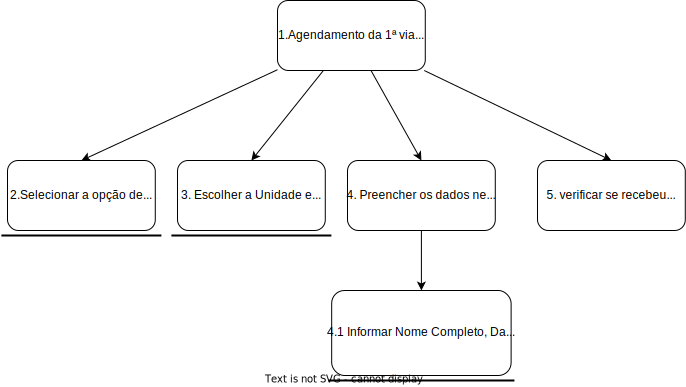
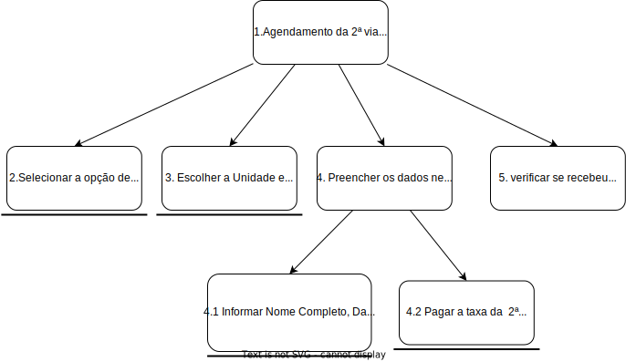

<h1 align="center">Análise de Tarefas</h1>
 
## Introdução

A análise de tarefas é comumente utilizada em IHC para obter um entendimento sobre qual é o trabalho dos usuários, entrando em detalhes da realização de tarefas e a motivação por trás delas. Neste trabalho, serão empregados dois métodos de análise de tarefas:

- **Análise Hierárquica de Tarefas** (HTA - *Hierarchical Task Analysis*), no qual **tarefas** são uma parte do trabalho, são decompostas em **objetivos, subobjetivos e operações**, sobrepostos em um **plano** que define a ordem dos subobjetivos alcançados(como pode ser visto nas figuras 1 e 2 abaixo);

- **GOMS** (*Goals, Operators, Methods, Selection Rules*), que descreve as tarefas em termos de **objetivos** do usuário, **operadores** divididos em primitivas internas ou externas, **métodos** que são uma sequência bem conhecida de subobjetivos e operadores, e **regras de seleção** que determinam a utilização de certo método numa determinada situação.

# Aplicação em Análise Hierárquica de Tarefas:

<figcaption align='center'>
   <h6><b>Figura 1 - HTA para Agendamento da 1ª via Fonte: Autoria própria </h6>
</figcaption>

<figcaption align='center'>
   <h6><b>Figura 1 - HTA para Agendamento da 2ª via Fonte: Autoria própria </h6>
</figcaption>

# Aplicação em GOMS:
GOAL 0: Agendamento da carteira de identidade

    GOAL 1: Agendamento da 1ª via:
        METHOD 1.A: escolher entre os horários disponíveis no site
        (SEL.RULE: O usuário deseja agendar em uma unidade de polícia particular)
            OP. 1.A.A.1.: Deslocar o mouse até "Serviços" na aba superior direita;
            OP. 1.A.A.2.: Clicar na opção "Carteira de Identidade";
            OP. 1.A.A.3: Clicar na opção " 1ª via", na parte de baixo;
            OP. 1.A.A.4: Deslocar o mouse para o botão "serviços";
            OP. 1.A.A.5: Clicar com o botão esquerdo do mouse e selecionar "Carteira de Identidade - 1ª via";
            OP. 1.A.A.6: Clicar com o botão esquerdo do mouse no butão verde da opção desejada;
            OP. 1.A.A.7: Preencher os dados com o Nome Completo,Data de nascimento,CPF,E-mail e Telefone;
            OP. 1.A.A.8: verificar se recebeu o comprovante com o código de agendamento;

    GOAL 2: Agendamento da 2ª via:
        METHOD 2.A: escolher entre os horários disponíveis no site
        (SEL.RULE: O usuário deseja agendar em uma unidade de polícia particular)
            OP. 2.A.A.1.: Deslocar o mouse até "Serviços" na aba superior direita;
            OP. 2.A.A.2.: Clicar na opção "Carteira de Identidade";
            OP. 2.A.A.3: Clicar na opção " 2ª via", na parte de baixo;
            OP. 2.A.A.4: Deslocar o mouse para o botão "serviços";
            OP. 2.A.A.5: Clicar com o botão esquerdo do mouse e selecionar "Carteira de Identidade - 2ª via";
            OP. 2.A.A.6: Clicar com o botão esquerdo do mouse no butão verde da opção desejada;
            OP. 2.A.A.7: Preencher os dados com o Nome Completo,Data de nascimento,CPF,E-mail e Telefone;
            OP. 2.A.A.8: Pagar a taxa da 2ª via caso este não estaja isento;
            OP. 2.A.A.9: verificar se recebeu o comprovante com o código de agendamento;

## Referências

> [1] BARBOSA; SILVA. **Processos de Design de IHC**. Cap. 6. Acesso em: 6 de dezembro de 2022.

## Histórico de Versão

|  Data  | Versão | Descrição | Autor | Revisor |
| :----: | :----: | :-------: | :---: | :--------:|
| 7/12/2022 | 1.0 | Implementação do arquivo| Rodrigo de Andrade  | Guilherme de Oliveira |
| 7/12/2022 | 1.1 | Adicionando a aplicação de GOMS e HTA e fazendo correções| Guilherme de Oliveira  | Rodrigo de Andrade |
