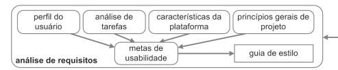
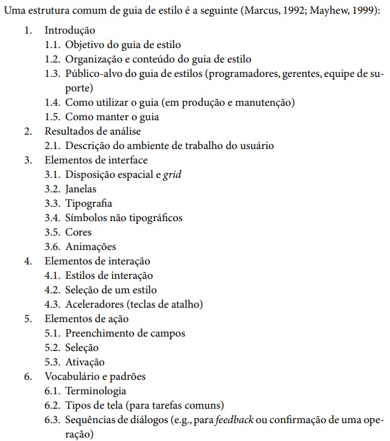

<h1 align="center">Guia de Estilo</h1>

## 1. Introdução
O **guia de estilo** de um site ou de uma instituição representa o padrão visual, sendo um registro das principais decisões de design tomadas pela equipe, o qual diversos elementos do site têm de aderir, criando uma identidade visual própria e distinta.

Quando feita cuidadosamente, promove sentimentos positivos na experiência do usuário ao interagir com esses elementos. No entanto, tem de tomar cuidado ao desenvolvê-lo, pois um guia de estilo de baixa qualidade ou a sua falta pode resultar no site se tornando visualmente amador e mal feito aos olhos do usuário. É também importante que as decisões de design possam ser facilmente consultadas e reutilizadas nas discussões sobre extensões ou versões futuras do produto (Diniz, Santana, 2010).

O site da PCDF segue a estrutura do Portal Institucional Padrão, o qual contém o seu próprio Guia de Estilo que será constantemente referenciado e demonstrado ao longo deste artefato.

### 1.1 Objetivo do Guia de Estilo

Um guia de estilo bem documentado promove a comunicação entre a equipe, permitindo o desenvolvimento mais fluido de novas ideias e refinar as partes necessárias, ações que unem a identidade visual do site harmoniosamente. De acordo com o ciclo de vida de Mayhew, e como pode ser visto na figura 1, é um dos elementos principais da fase de análise de requisitos no desenvolvimento de um site. 

    <figcaption align='center'>
        <h6> Figura 1:</b> Fase de Análise de Requisitos do Ciclo de Vida de Mayhew. Fonte: Barbosa, 2021, pág. 110
    </figcaption>

O Guia de Estilo desenvolvido neste projeto tem como objetivos:
<ul>
  <li>ser desenvolvido com base nos elementos visuais apresentados no site da PCDF, fornecendo sua identidade visual de design bem documentada; </li>
  <li>apontar possíveis falhas e melhoras, com base em critérios apresentados ao longo da matéria de IHC.</li>
</ul>

### 1.2 Organização e Conteúdo do Guia de Estilo

Este Guia de Estilo seguirá a estrutura apontada na figura 2, a seguir:

    <figcaption align='center'>
        <h6>Figura 2:</b> Estrutura de Guia de Estilo sugerida por Marcus e Mayhew. Fonte: Diniz, Santana: **Interação Humano-Computador**. 2010, cap. 8, pág. 283
    </figcaption>

### 1.3 Público-alvo do Guia de Estilo

Este Guia de Estilo está destinado a programadores e a equipe de design, almejando unir os dados referentes a identidade visual do site da PCDF e torná-los facilmente acessíveis.

### 1.4 Como Utilizar o Guia de Estilo

Este Guia, assim como todos os artefatos desenvolvidos pelo Grupo 6, podem ser usados como referência no processo de design de um site e/ou do processo de elaboração do projeto da matéria de IHC. Deve-se ler com cuidado os estilos definidos pelo Portal Institucional Padrão e suas aplicações no site da PCDF, objetivando a melhor compreensão do leitor em relação ao design apresentado. Este Guia deve como parte de um processo reflexivo de design, sendo utilizado mais como uma ferramenta de apoio ao trabalho do que um conjunto rígido de regras (Diniz, Santana, 2010).

Durante a manutenção, este Guia deve seguir as normas de manutenção e políticas de commits sugeridas pelo Grupo 6, assim como os outros artefatos nesse projeto.

### 1.5 Como Manter o Guia de Estilo

Considerando a importância durante o projeto inteiro, este Guia deve ser mantido e atualizado durante a fase de Design, Avaliação e Desenvolvimento, considerando o Ciclo de Vida de Mayhew, sendo esse o abordado durante este projeto. Ele deve conter uma boa estrutura para usar como um processo reflexivo que guie a equipe ao longo das fases 1 e 2 do Ciclo de Vida de Mayhew.

## 2. Resultados de Análise

## Referências

> [1] [Guia de Estilo do Portal Institucional Padrão.](docs/../guia_de_estilo_identidade_padrao_comunicacao.pdf)

> [2] BARBOSA; SILVA. **Processos de Design de IHC**. 2021. Cap. 4: pág. 110. Acesso em: 11 de dezembro de 2022.

> [3] DINIZ; SANTANA. **INTERAÇÃO HUMANO-COMPUTADOR**. Rio de Janeiro: Elsevier, 2010. Cap. 8: pág. 282. Acesso em: 11 de dezembro de 2022.

## Histórico de Versão

|    Data    | Versão |      Descrição       |                                              Autor(es)                                              |                                    Revisor(es)                                    |
| :--------: | :----: | :------------------: | :-------------------------------------------------------------------------------------------------: | :-------------------------------------------------------------------------------: |
| 11/12/2022 |  1.0   | Criação do documento | [Gabriel Marcolino](https://github.com/GabrielMR360) e [Rodrigo](https://github.com/OrlandiRodrigo) | [Yago](https://github.com/yagompassos) e [Guilherme](https://github.com/GG555-13) | 
| 11/12/2022 |  1.1   | Adição do Tópico 1 | [Gabriel Marcolino](https://github.com/GabrielMR360) e [Rodrigo](https://github.com/OrlandiRodrigo) | [Yago](https://github.com/yagompassos) e [Guilherme](https://github.com/GG555-13) |