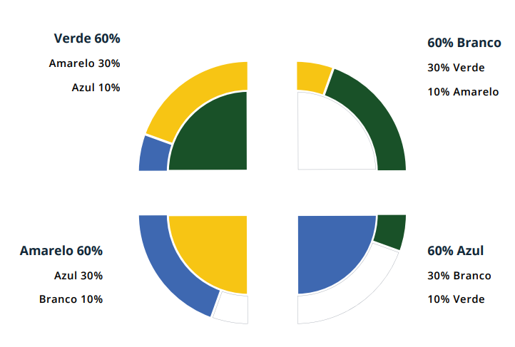

<h1 align="center">Guia de Estilo</h1>

## 1. Introdução
O **guia de estilo** de um site ou de uma instituição representa o padrão visual, sendo um registro das principais decisões de design tomadas pela equipe, o qual diversos elementos do site têm de aderir, criando uma identidade visual própria e distinta.

Quando feita cuidadosamente, promove sentimentos positivos na experiência do usuário ao interagir com esses elementos. No entanto, tem de tomar cuidado ao desenvolvê-lo, pois um guia de estilo de baixa qualidade ou a sua falta pode resultar no site se tornando visualmente amador e mal feito aos olhos do usuário. É também importante que as decisões de design possam ser facilmente consultadas e reutilizadas nas discussões sobre extensões ou versões futuras do produto (Diniz, Santana, 2010).

O site da PCDF segue a estrutura do [Portal Institucional Padrão](docs/../guia_de_estilo_identidade_padrao_comunicacao.pdf), o qual contém o seu próprio Guia de Estilo que será constantemente referenciado e demonstrado ao longo deste artefato.

### 1.1 Objetivo do Guia de Estilo

Um guia de estilo bem documentado promove a comunicação entre a equipe, permitindo o desenvolvimento mais fluido de novas ideias e refinar as partes necessárias, ações que unem a identidade visual do site harmoniosamente. De acordo com o ciclo de vida de Mayhew, e como pode ser visto na figura 1, é um dos elementos principais da fase de análise de requisitos no desenvolvimento de um site. 

    <figcaption align='center'>
        <h6> Figura 1:</b> Fase de Análise de Requisitos do Ciclo de Vida de Mayhew. Fonte: Barbosa, 2021, pág. 110
    </figcaption>

O Guia de Estilo desenvolvido neste projeto tem como objetivos:
<ul>
  <li>ser desenvolvido com base nos elementos visuais apresentados no site da PCDF, fornecendo sua identidade visual de design bem documentada; </li>
  <li>apontar possíveis falhas e melhoras, com base em critérios apresentados ao longo da matéria de IHC.</li>
</ul>

### 1.2 Organização e Conteúdo do Guia de Estilo

Este Guia de Estilo seguirá a estrutura apontada na figura 2, a seguir:

    <figcaption align='center'>
        <h6>Figura 2:</b> Estrutura de Guia de Estilo sugerida por Marcus e Mayhew. Fonte: Diniz, Santana: **Interação Humano-Computador**. 2010, cap. 8, pág. 283
    </figcaption>

### 1.3 Público-alvo do Guia de Estilo

Este Guia de Estilo está destinado a programadores e a equipe de design, almejando unir os dados referentes a identidade visual do site da PCDF e torná-los facilmente acessíveis.

### 1.4 Como Utilizar o Guia de Estilo

Este Guia, assim como todos os artefatos desenvolvidos pelo Grupo 6, podem ser usados como referência no processo de design de um site e/ou do processo de elaboração do projeto da matéria de IHC. Deve-se ler com cuidado os estilos definidos pelo Portal Institucional Padrão e suas aplicações no site da PCDF, objetivando a melhor compreensão do leitor em relação ao design apresentado. Este Guia deve como parte de um processo reflexivo de design, sendo utilizado mais como uma ferramenta de apoio ao trabalho do que um conjunto rígido de regras (Diniz, Santana, 2010).

Durante a manutenção, este Guia deve seguir as normas de manutenção e políticas de commits sugeridas pelo Grupo 6, assim como os outros artefatos nesse projeto.

### 1.5 Como Manter o Guia de Estilo

Considerando a importância durante o projeto inteiro, este Guia deve ser mantido e atualizado durante a fase de Design, Avaliação e Desenvolvimento, considerando o Ciclo de Vida de Mayhew, sendo esse o abordado durante este projeto. Ele deve conter uma boa estrutura para usar como um processo reflexivo que guie a equipe ao longo das fases 1 e 2 do Ciclo de Vida de Mayhew.

## 2. Resultados de Análise

## 3. Elementos de Interface

Como estabelecido na introdução, a estrutura do site da PCDF pertence à identidade visual do [Guia de Estilo do Portal Institucional Padrão](docs/../guia_de_estilo_identidade_padrao_comunicacao.pdf), e os elementos apresentados serão baseadas no arquivo. 

### 3.1 Disposição Espacial e Grid

A estrutura do grid, com distância medida em pixels, se apresenta nas figuras 3 e 4, a seguir. Na figura 4, o grid está aplicado a um layout padrão de 1024 pixels, que é a largura padrão para janelas de navegadores.

    <figcaption align='center'>
        <h6>Figura 3:</b> Estrutura do Grid. Fonte: Guia de Estilo Padrão Comunicação (Portal Institucional Padrão)
    </figcaption>

   

    <figcaption align='center'>
        <h6>Figura 4:</b> Grid aplicado em uma tela de 1024 pixels. Fonte: Guia de Estilo Padrão Comunicação (Portal Institucional Padrão)
    </figcaption>

 

Além do padrão usual de 1024 pixels de largura, há uma disposição própria para quando se reajusta a tela, separadas em duas categorias:
<ul>
  <li>telas menores que 1024 pixels de largura; </li>
  <li>telas menores que 768 pixels de largura,</li>
</ul>

as quais podem ser vistas, respectivamente, nas figuras 5 e 6. 

    <figcaption align='center'>
        <h6>Figura 5:</b> Grid aplicado em uma tela menor que 1024 pixels. Fonte: Guia de Estilo Padrão Comunicação (Portal Institucional Padrão)
    </figcaption>

 

    <figcaption align='center'>
        <h6>Figura 6:</b> Grid aplicado em uma tela menor que 768 pixels. Fonte: Guia de Estilo Padrão Comunicação (Portal Institucional Padrão)
    </figcaption>

 

O site da PCDF segue a estrutura descrita fielmente na aba de agendamento, com a sua própria paleta de cores e elementos gráficos, como representado na figura 7 a seguir.

    <figcaption align='center'>
        <h6>Figura 7:</b> Grid aplicado no site da PCDF. Fonte: [Site da PCDF - Seção de Agendamento](https://www.pcdf.df.gov.br/servicos/carteira-de-identidade#agendar)
    </figcaption>

 

### 3.2 Janelas

As janelas apresentadas pela seção de agendamento do site da PCDF levam o usuário a uma variedade de serviços relacionados a carteira de identidade, desde o agendamento, reagendamento, consulta do processo e perguntas frequentes, como representados na figura 8, até locais de atendimento e informações adicionais do processo e links atrelados ao Google Maps dos locais de atendimento, como ilustrado na figura 9.

    <figcaption align='center'>
        <h6>Figura 8:</b> Opções de serviço relacionados a carteira de identidade. Fonte: [Site da PCDF - Seção de Agendamento](https://www.pcdf.df.gov.br/servicos/carteira-de-identidade#agendar)
    </figcaption>

 

    <figcaption align='center'>
        <h6>Figura 9:</b> Locais de atendimento para os serviços de carteira de identidade. Fonte: [Site da PCDF - Seção de Agendamento](https://www.pcdf.df.gov.br/servicos/carteira-de-identidade#agendar)
    </figcaption>

 

A estrutura apresentada pela maioria das janelas apresentadas segue a mesma definida pelo Guia de Estilo do Portal Institucional Padrão, como visto na figura 10. No entanto, o serviço de agendamento em si possui uma estrutura completamente diferente, ilustrada na figura 11, o que pode causar uma leve sensação de desconforto ao usuário quando acessando o principal serviço do site.

Notavelmente, o link de acesso muda de https://www.pcdf.df.gov.br para https://agendaservico.pcdf.df.gov.br/Agenda/Consultar, o que denota a utilização de outro site e, consequentemente, outra estrutura.

 

    <figcaption align='center'>
        <h6>Figura 10:</b> Janela de reimpressão fácil da segunda via da carteira de identidade. Fonte: [Site da PCDF - Segunda Via Fácil - Reimpressão](https://www.pcdf.df.gov.br/servicos/carteira-de-identidade/2-via-facil-reimpressao)
    </figcaption>

 

    <figcaption align='center'>
        <h6>Figura 11:</b> Site destinado para consulta/agendamento de serviços relacionados à carteira de identidade. Fonte: [Site da PCDF - Consulta/Agendamento](https://agendaservico.pcdf.df.gov.br/Agenda/Consultar)
    </figcaption>

 

### 3.3 Tipografia

A tipografia registrada no Guia de Estilo do Portal Institucional Padrão inclui as fontes *Open Sans* e *Arial*, respectivamente ilustradas nas figuras 12 e 13.  

 

    <figcaption align='center'>
        <h6>Figura 12:</b> Fonte *Open Sans*. Fonte: Guia de Estilo Padrão Comunicação (Portal Institucional Padrão)
    </figcaption>

 

    <figcaption align='center'>
        <h6>Figura 13:</b> Fonte *Arial*. Fonte: Guia de Estilo Padrão Comunicação (Portal Institucional Padrão)
    </figcaption>

 

Seus usos são específicos, com a estrutura do site atribuindo tamanhos e padrões diferentes para as fontes dependendo de onde é empregada. Para chamadas, a fonte que deve ser empregada é a *Arial*, enquanto que a *Open Sans* é usualmente utilizada para títulos e nomes, como pode-se ver na figura 14.

 

    <figcaption align='center'>
        <h6>Figura 14:</b> Uso destinado das fontes. Fonte: Guia de Estilo Padrão Comunicação (Portal Institucional Padrão)
    </figcaption>

 

No caso do site da PCDF, a estrutura é seguida normalmente, além do título da PCDF em si e imagens originais carregadas ao site, os quais não necessariamente precisam aderir à estrutura definida do Portal Institucional Padrão.

 

    <figcaption align='center'>
        <h6>Figura 15:</b> Identificação de fontes utilizadas no site da PCDF. Fonte: [Site da PCDF - Seção de Agendamento.](https://www.pcdf.df.gov.br/servicos/carteira-de-identidade#agendar)
    </figcaption>

 

### 3.4 Cores

As cores têm de ser estritamente seguidas, representando a imagem do Governo Federal a partir de uma identidade única. O Guia de Estilo do Portal Institucional Padrão apresenta as cores principais escolhidas, em forma de disco cromático, em valores RGB e hexadecimal, assim como exemplos de aplicação em degradês, como está ilustrado nas figuras 16 a 19.

 

    <figcaption align='center'>
        <h6>Figura 16:</b> Cores principais escolhidas para representar o Governo Federal. Fonte: Guia de Estilo Padrão Comunicação (Portal Institucional Padrão)
    </figcaption>

 

É importante notar que, mesmo de acordo com a caixa de texto da figura acima, o site pode ser representado por uma mistura específica (disco cromático) das cores principais, a fim de preservar a identidade individual das instituições do Governo Federal.

 

    <figcaption align='center'>
        <h6>Figura 17:</b> Disco cromático das cores principais. Fonte: Guia de Estilo Padrão Comunicação (Portal Institucional Padrão)
    </figcaption>

 

    <figcaption align='center'>
        <h6>Figura 18:</b> Valores em RGB e hexadecimal das cores principais e cores secundárias. Fonte: Guia de Estilo Padrão Comunicação (Portal Institucional Padrão)
    </figcaption>

 

    <figcaption align='center'>
        <h6>Figura 19:</b> Exemplos de como realizar e como não fazer o degradê das cores principais. Fonte: Guia de Estilo Padrão Comunicação (Portal Institucional Padrão)
    </figcaption>

 

O site da PCDF foi desenvolvido utilizando as cores representadas no emblema da mesma, buscando representar a identidade visual do Governo Federal enquanto prezando pela da Polícia Civil do Distrito Federal. O disco cromático aplicado é mais customizado quando comparado às variações apresentadas no Guia de Estilo do Portal Institucional Padrão. A figura 20 representa uma paleta mais geral e as cores principais utilizadas no site da PCDF.

    <figcaption align='center'>
        <h6>Figura 20:</b> Extração das cores principais e paletas do site da PCDF por meio do site https://imagecolorpicker.com/. Fonte: [Site do Image Color Picker.](https://imagecolorpicker.com/)
    </figcaption>

 

## 6. Vocabulário e Padrões 

### 6.1 Terminologia
Nenhuma terminologia específica foi encontrada no site da PCDF. Considerando o amplo público alvo do serviço, uma terminologia específica seria relativamente detrimental ao serviço de agendamento de carteiras de identidade.

### 6.2 Tipos de Tela
Os tipos de tela do site da PCDF em relação ao serviço de agendamento incluem o site que segue a estrutura do Guia de Estilo do Portal Institucional Padrão e a estrutura adotada com o serviço de agendamento/consulta, este sendo outro site. Esses tipos foram demonstrados nas [figuras 10](#32-janelas) e [11](#32-janelas).

### 6.3 Sequências de Diálogos
Nenhuma sequência de diálogo específica foi encontrada, além da inserção de dados no login e seleção da hora/unidade da polícia na consulta/agendamento dos serviços da carteira de identidade.

## Referências

> [1] [Guia de Estilo do Portal Institucional Padrão.](docs/../guia_de_estilo_identidade_padrao_comunicacao.pdf)

> [2] BARBOSA; SILVA. **Processos de Design de IHC**. 2021. Cap. 4: pág. 110. Acesso em: 11 de dezembro de 2022.

> [3] DINIZ; SANTANA. **INTERAÇÃO HUMANO-COMPUTADOR**. Rio de Janeiro: Elsevier, 2010. Cap. 8: pág. 282. Acesso em: 11 de dezembro de 2022.

> [4] [Seção de agendamento do site da PCDF.](https://www.pcdf.df.gov.br/servicos/carteira-de-identidade#agendar)  Acesso em: 11 de dezembro de 2022.

> [5] [Site da PCDF - Consulta/Agendamento.](https://agendaservico.pcdf.df.gov.br/Agenda/Consultar) Acesso em: 12 de dezembro de 2022.

> [6] [Site do Image Color Picker.](https://imagecolorpicker.com/) Acesso em: 12 de dezembro de 2022.

## Histórico de Versão

|    Data    | Versão |      Descrição       |                                              Autor(es)                                              |                                    Revisor(es)                                    |
| :--------: | :----: | :------------------: | :-------------------------------------------------------------------------------------------------: | :-------------------------------------------------------------------------------: |
| 11/12/2022 |  1.0   | Criação do documento | [Gabriel Marcolino](https://github.com/GabrielMR360) e [Rodrigo](https://github.com/OrlandiRodrigo) | [Yago](https://github.com/yagompassos) e [Guilherme](https://github.com/GG555-13) | 
| 11/12/2022 |  1.1   | Adição do Tópico 1 | [Gabriel Marcolino](https://github.com/GabrielMR360) e [Rodrigo](https://github.com/OrlandiRodrigo) | [Yago](https://github.com/yagompassos) e [Guilherme](https://github.com/GG555-13) |