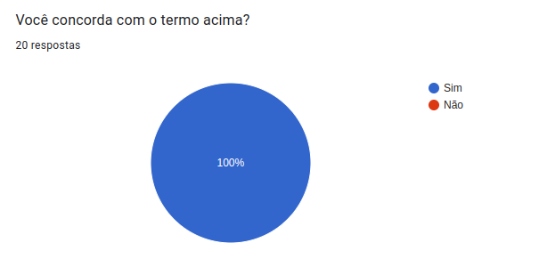
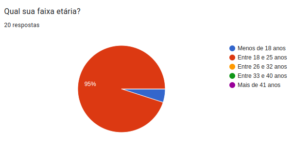
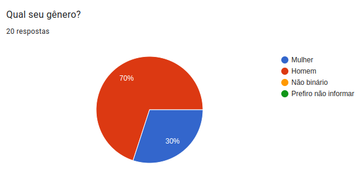
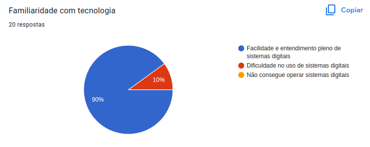
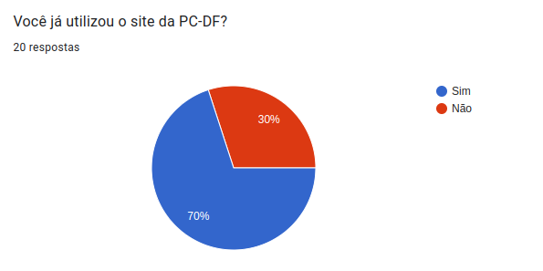
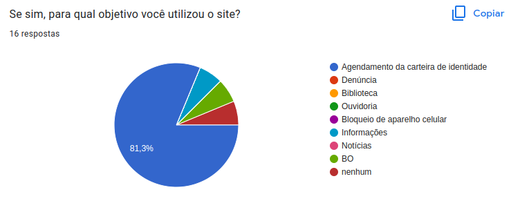
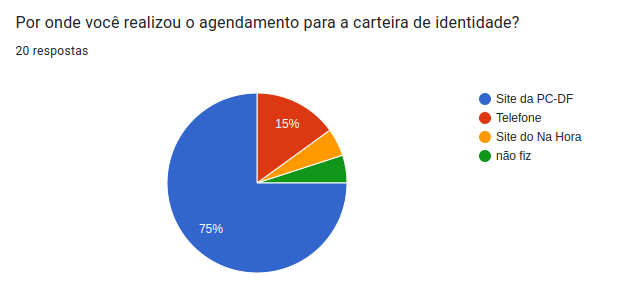
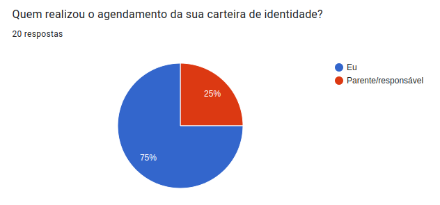
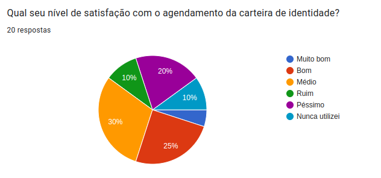

<h1 align="center">Perfil de Usuário</h1>

## Introdução

O **perfil de usuário** é uma descrição detalhada das características dos usuários, muito importante para a análise de requisitos pois ajuda os avaliadores a conduzir o processo de IHC com base nos dados coletados dos usuários, para que a partir disso possamos agregar os valores dos dados coletados em grupos e faixas nas quais os usuários se encaixam, e assim traçar os perfis com características semelhantes e observar a quantidade de usuários que se encaixam em cada perfil.

## Metodologia 

Para traçar o perfil dos nossos usuários nós conduzimos um estudo com questionários, pois se trata de um método de coleta de dados relativamente barato, rápido, fácil para analisar os dados e permite coletar informações de muitos usuários. Para isso, criamos um formulário com 8 perguntas visando analisar e agrupar os usuários em relação a [dados demográfico](#dados-demograficos), [experiência com computadores](#experiencia-com-computadores) e [familiaridade com o site e tarefas](#familiaridade-com-o-site-e-tarefas). 

Ao todo 20 pessos responderam ao questionário. Abaixo temos a figura 1 que mostra que todos os usuários que responderam ao questionário concordaram com o termo de consentimento livre e esclarecido.

   
    <figcaption align='center'>
        <h6><b>Figura 1:</b> Respostas ao termo de consentimento. Fonte : Elaboração de Yago e Gabriel</h6>
    </figcaption>

### Dados demográficos

A Figura 2 mostra a relação da faixa etária entre os usuários que responderam o questionário.

   
    <figcaption align='center'>
        <h6><b>Figura 2:</b> Resposta da primeira pergunta. Fonte : Elaboração de Yago e Gabriel</h6>
    </figcaption>

A Figura 3 mostra a relação do gênero entre os usuários que responderam o questionário.

   
    <figcaption align='center'>
        <h6><b>Figura 3:</b> Resposta da segunda pergunta. Fonte : Elaboração de Yago e Gabriel</h6>
    </figcaption>

### Experiência com computadores

A Figura 4 mostra a o nível de conhecimento e familiaridade com tecnologia, no geral, entre os usuários que responderam o questionário.

   
    <figcaption align='center'>
        <h6><b>Figura 4:</b>Resposta da terceira pergunta. Fonte : Elaboração de Yago e Gabriel</h6>
    </figcaption>

### Familiaridade com o site e Tarefas

A Figura 5 mostra a quantidade de usuários já teve alguma interação com o sistema da PCDF, em seguida, a figura 5 especifica esse uso.

   
    <figcaption align='center'>
        <h6><b>Figura 5:</b>Resposta da quarta pergunta. Fonte : Elaboração de Yago e Gabriel</h6>
    </figcaption>

A figura 6 mostra para qual objetivo os usuários entraram no site.

   
    <figcaption align='center'>
        <h6><b>Figura 6:</b>Resposta da quinta pergunta. Fonte : Elaboração de Yago e Gabriel</h6>
    </figcaption>

A Figura 7 mostra a escolha do usuário pela forma de agendar a carteira de identidade.

   
    <figcaption align='center'>
        <h6><b>Figura 7:</b>Resposta da sexta pergunta. Fonte : Elaboração de Yago e Gabriel</h6>
    </figcaption>

A Figura 8 mostra a quem realizou o agendamento da carteira de identidade, se foi o usuário em si ou um familiar.

   
    <figcaption align='center'>
        <h6><b>Figura 8:</b>Resposta da setima pergunta. Fonte : Elaboração de Yago e Gabriel</h6>
    </figcaption>

A Figura 9 mostra a satisfação dos usuários com o uso do sistema da PCDF.

   
    <figcaption align='center'>
        <h6><b>Figura 9:</b>Resposta da oitava pergunta. Fonte : Elaboração de Yago e Gabriel</h6>
    </figcaption>

## Referências

> [1] BARBOSA; SILVA. **Organização do Espaço de Problema**. Capítulo. 8. Acesso em: 07 de dezembro de 2022.

## Histórico de Versão

|    Data    | Versão |                   Descrição                   |                                              Autor(es)                                               |                                       Revisor(es)                                       |
| :--------: | :----: | :-------------------------------------------: | :--------------------------------------------------------------------------------------------------: | :-------------------------------------------------------------------------------------: |
| 06/12/2022 |  1.0   |             Criação do documento              | [Gabriel Marcolino](https://github.com/GabrielMR360) e [Yago Passos](https://github.com/yagompassos) | [Rodrigo](https://github.com/OrlandiRodrigo) e [Guilherme](https://github.com/GG555-13) |
| 07/12/2022 |  1.1   |    Alterando a introdução e a metodologia     |                         [Gabriel Marcolino](https://github.com/GabrielMR360)                         | [Rodrigo](https://github.com/OrlandiRodrigo) e [Guilherme](https://github.com/GG555-13) |
| 07/12/2022 |  1.2   | Adicionando imagens dos dados do questionário |                         [Gabriel Marcolino](https://github.com/GabrielMR360)                         | [Rodrigo](https://github.com/OrlandiRodrigo) e [Guilherme](https://github.com/GG555-13) |

