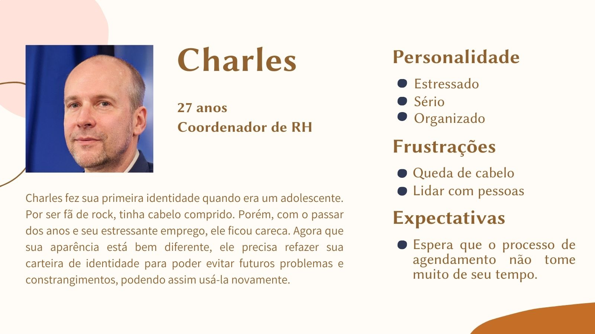
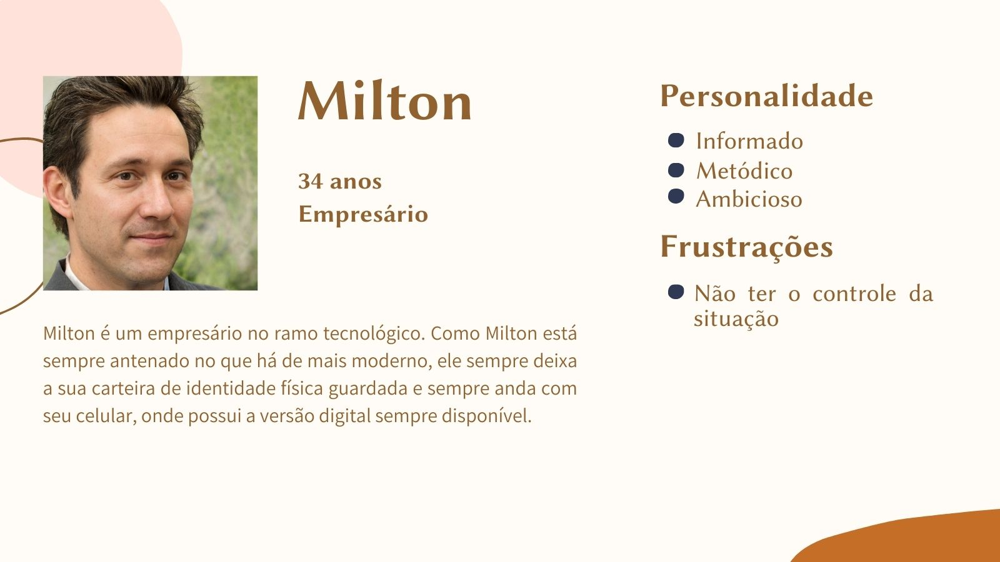

<h1 align="center">Personas</h1>

## Introdução
Uma persona é um personagem fictício, arquétipo hipotético de um grupo de usuários reais, criada para descrever um usuário típico (Cooper et al., 2007; Pruitt e Adlin,
2006; Cooper, 1999). É utilizada principalmente para representar um grupo de usuários fi nais durante discussões de design, mantendo todos focados no mesmo alvo.

Cada persona foi desenvolvida com base no perfil do usuário, sendo assim, ao todo foram 4 personas com perfis diferentes e 1 delas sendo a antipersona. Como o serviço estudado compreende diversos usuários, queríamos representar alguns arquétipos principais pelas personas desenvolvidas, e acabamos ficando com os exemplos citados.

## Vera

Tem como objetivo, agendar a primeira carteira de identidade do filho mais novo.

<figcaption align='center'>
   <h6><b>Figura 1: Persona, Vera e suas características Fonte : Fonte: Autoria própria </h6>
</figcaption>

## Enzo

Tem como objetivo, tirar a segunda via da identidade pois perdeu a primeira via.

<figcaption align='center'>
   <h6><b>Figura 2: Persona, Enzo e suas características Fonte : Fonte: Autoria própria </h6>
</figcaption>

## Charles

Tem como objetivo, tirar segunda via da identidade pois sua aparência mudou bastante com o tempo.

<figcaption align='center'>
   <h6><b>Figura 3: Persona, Charles e suas características Fonte : Fonte: Autoria própria </h6>
</figcaption>

## Maria

Tem como objetivo, atualizar o documento de identidade.

<figcaption align='center'>
   <h6><b>Figura 4: Persona, Maria e suas características Fonte : Fonte: Autoria própria </h6>
</figcaption>

## Milton - Antipersona

<figcaption align='center'>
   <h6><b>Figura 5: Persona, Milton e suas características Fonte : Fonte: Autoria própria </h6>
</figcaption>

## Referências

> [1] 2022.1-Millenium-Papelaria. GitHub. Disponível em: https://github.com/Interacao-Humano-Computador/2022.1-Millenium-Papelaria. Acesso em: 06 de dezembro de 2022.

> [2] 2022.1-Dominio-Publico. GitHub. Disponível em: https://github.com/Interacao-Humano-Computador/2022.1-Dominio-Publico. Acesso em: 06 de dezembro de 2022.

> [3] BARBOSA; SILVA. **Organização do Espaço de Problema**. Cap. 6. Acesso em: 06 de dezembro de 2022.

## Histórico de Versão

|    Data    | Versão |                          Descrição                          |                                            Autor(es)                                             |                                               Revisor                                                |
| :--------: | :----: | :---------------------------------------------------------: | :----------------------------------------------------------------------------------------------: | :--------------------------------------------------------------------------------------------------: |
| 06/12/2022 |  1.0   |                    Criação do documento                     | [Jefferson Franca](https://github.com/Frans6) e [Lucas Spinosa](https://github.com/LucasSpinosa) | [Gabriel Marcolino](https://github.com/GabrielMR360) e [Yago Passos](https://github.com/yagompassos) |
| 07/12/2022 |  1.1   |               Corrigindo caminho das imagens                |                       [Gabriel Marcolino](https://github.com/GabrielMR360)                       |   [Jefferson Franca](https://github.com/Frans6) e [Lucas Spinosa](https://github.com/LucasSpinosa)   |
| 07/12/2022 |  1.2   | Adicionando referências e complementando texto introdutório | [Jefferson Franca](https://github.com/Frans6) e [Lucas Spinosa](https://github.com/LucasSpinosa) | [Gabriel Marcolino](https://github.com/GabrielMR360) e [Yago Passos](https://github.com/yagompassos) |
