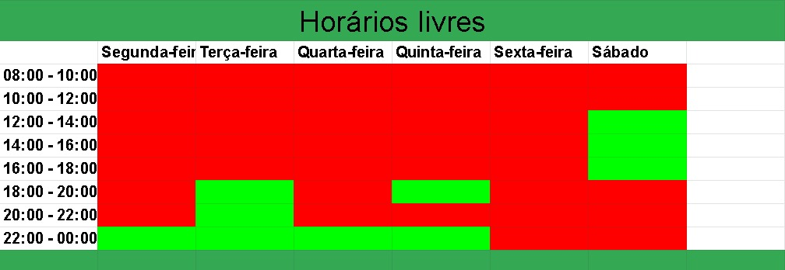

<h1 align="center">Cronograma das Atividades</h1>

O cronograma de atividades tem como objetivo organizar o planejamento das tarefas que vão ser entregues no projeto. Ele foi elaborado com base no plano de ensino do professro André Barros de Sales, onde o mesmo já tem definido as datas das entregas.

As entregas dos artefatos serão realizadas com 1 dia de antecedencia da data limite para que haja tempo das revisões serem feitas e realizar as correções caso necessário nos artefatos desenvolvidos.

## Entrega 1 - (24/11)

|          Tarefa           | Data Limite |              Autor(er)               | Revisor(es) |
| :-----------------------: | :---------: | :----------------------------------: | :---------: |
| Cronograma das atividades |    23/11    | Gabriel Marcolino e Jefferson Franca |             |
|  Ferramentas do projeto   |    23/11    |               Gabriel                |             |
|    Introdução e Equipe    |    23/11    |              Jefferson               |             |
| Lista de sites avaliados  |    23/11    |                                      |             |
|  Planejamento do projeto  |    23/11    |                                      |             |
|    Processo de design     |    23/11    |                                      |             |
|      Site escolhido       |    23/11    |                                      |             |

## Entrega 2 - (07/12)

|                     Tarefa                      | Data Limite | Autor(es) | Revisor(es) |
| :---------------------------------------------: | :---------: | :-------: | :---------: |
| Aspectos éticos de pesquisas envolvendo pessoas |    06/12    |           |             |
|                Perfil do usuário                |    06/12    |           |             |
|          Personas e análise de tarefas          |    06/12    |           |             |

## Entrega 3 - (12/12)

|            Tarefa            | Data Limite | Autor(es) | Revisor(es) |
| :--------------------------: | :---------: | :-------: | :---------: |
|        Guia de estilo        |    11/12    |           |             |
|     Metas de usabilidade     |    11/12    |           |             |
| Princípios Gerais de Projeto |    11/12    |           |             |

## Entrega 4 - (14/12)

|                                  Tarefa                                  | Data Limite | Autor(es) | Revisor(es) |
| :----------------------------------------------------------------------: | :---------: | :-------: | :---------: |
|                 Planejamento da Avaliação do Storyboard                  |    13/12    |           |             |
|     Planejamento do relato dos resultados da avaliação do Storyboard     |    13/12    |           |             |
|             Planejamento da Avaliação do Análise de tarefas              |    13/12    |           |             |
| planejamento do relato dos resultados da avaliação do Análise de tarefas |    13/12    |           |             |

## Entrega 5 - (02/01)

|                     Tarefa                     | Data Limite | Autor(es)  | Revisor(es) |
| :--------------------------------------------: | :---------: | :--------: | :---------: |
| Resultados do Story Board e Análise de tarefas |    01/01    | ---------- | ----------  |
|        Avaliação do protótipo de papel         |    01/01    | ---------- | ----------  |
| Resultados da avaliação do protótipo de papel  |    01/01    | ---------- | ----------  |

## Entrega 6 - (18/01)

|          Tarefa           | Data Limite | Autor(es)  | Revisor(es) |
| :-----------------------: | :---------: | :--------: | :---------: |
| Verificação dos artefatos |    17/01    | ---------- | ----------  |

## Entrega 7 - (11/01)

|                         Tarefa                          | Data Limite | Autor(es)  | Revisor(es) |
| :-----------------------------------------------------: | :---------: | :--------: | :---------: |
|            Resultados do protótipo de papel             |    10/01    | ---------- | ----------  |
|        Avaliação do protótipo de alta fidelidade        |    10/01    | ---------- | ----------  |
| Resultados da avaliação do protótipo de alta fidelidade |    10/01    | ---------- | ----------  |

## Entrega 08 - (25/01)

|                        Tarefa                         | Data Limite | Autor(es)  | Revisor(es) |
| :---------------------------------------------------: | :---------: | :--------: | :---------: |
| Relato dos resultados do protótipo de alta fidelidade | 24/01/2023  | ---------- | ----------  |

## Apresentação final - (01/02)

|    Tarefa     | Data Limite | Autor(es) | Revisor(es) |
| :-----------: | :---------: | :-------: | :---------: |
| Projeto final | 31/01/2023  | --------- | ----------- |

## Horários livres (Equipe)

Para poder decidir qual o melhor horário das reuniões semanais que teremos durante todo o projeto, foi feito uma planilha juntando todos os horários livres dos integrantes da equipe.

Com base no resultado da planilha, foi de comum acordo entre os membros da equipe que teremos reuniões semanais, as terças-feiras, para podermos discutir o projeto.  

Figura 1: Horários disponíveis para o grupo se reunir

Fonte: Autoria própria

## Referências

1.SALES, André Barros. Plano de ensino da disciplina. Disponível em: <https://aprender3.unb.br/>. Acesso em: 19 de novembro de 2022

## Histórico de Versão

|    Data    | Versão |      Descrição       |                                               Auto(es)                                               |
| :--------: | :----: | :------------------: | :--------------------------------------------------------------------------------------------------: |
| 19/11/2022 |  0.1   | Criação do documento | [Gabriel Marcolino](https://github.com/GabrielMR360) e [Jefferson Franca](https://github.com/Frans6) |