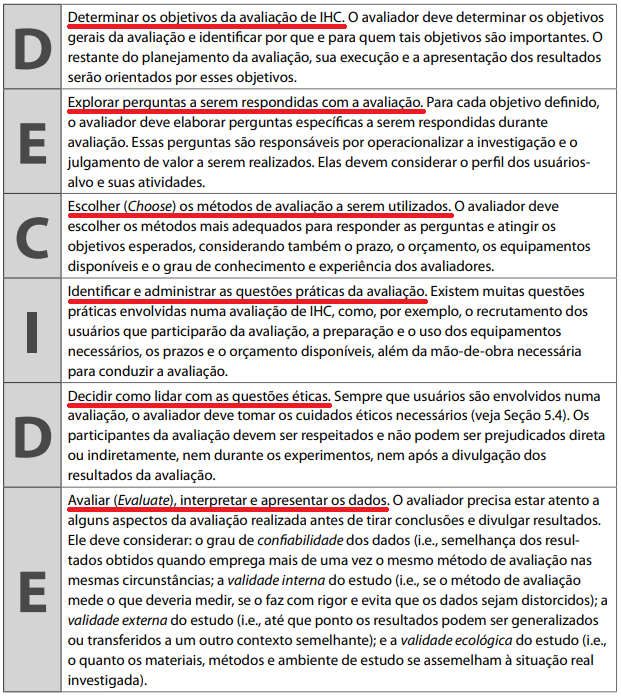

<h1 align="center">Aplicação do Framework DECIDE</h1>
 
## Introdução
Com o objetivo de tornar a avaliação sob o contexto da matéria de IHC mais eficiente e eficaz, o Framework DECIDE foi proposto por Preece et al(2002) para orientar seu planejamento, execução e análise [(Barbosa, Silva, 2010)](#referencias). Esse modelo é muito compreensivo dos apectos de uma avaliação, com todos seus pontos iterativos sendo completamente interligados. Apesar de possíveis complicações que indiquem uma mudança de objetivos, é de suma importância a aplicação neste projeto de análise do serviço de agendamento da PCDF, visando a realização de uma avaliação compreensiva e bem desenvolvida.

## Aspectos do Framework DECIDE:
O framework DECIDE é nomeado desse modo por causa dos 6 (seis) aspectos principais que o compõem, como podem ser vistos na figura 1, a seguir:

   
   <figcaption align='center'>
      <h6><b>Figura 1:</b> Significado do Framework DECIDE. Fonte: Processos de Design de IHC. Pág. 313</h6>
   </figcaption>

A maioria do grupo já havia trabalhado com esse Framework no [planejamento da avaliação](.//../escolha_do_site.md), habituando com a maneira de trabalhar dentro desse contexto.

## Aplicação do Framework DECIDE no contexto deste projeto:
Dentro do projeto de análise do serviço de agendamento do site da PCDF, o Framework DECIDE foi empregado ao longo das tarefas envolvendo a quarta entrega e a quinta, vistos na seção Design, Avaliação e Desenvolvimento, artefatos que seguem a implementação deste. Mais especificamente, o Framework DECIDE será aplicado na <b>Avaliação da Análise de Tarefas</b>, assim como a <b>Avaliação do Storyboard</b>, com o objetivo de criar ambos artefatos a partir de uma estrutura sólida.

## Referências

> [[1]](#introducao) BARBOSA, Simone; SILVA, Bruno. Processos de Design de IHC. _In_: BARBOSA, Simone; SILVA, Bruno. **Interação Humano-Computador**. Elsevier Editora Ltda, 2010. pág. 261-280

## Histórico de Versão

|    Data    | Versão |                         Descrição                          |                          Autor                          |                         Revisor                         |
| :--------: | :----: | :--------------------------------------------------------: | :-----------------------------------------------------: | :-----------------------------------------------------: |
| 14/12/2022 |  1.0   |                  Implementação do arquivo                  | [Rodrigo de Andrade](https://github.com/OrlandiRodrigo) |  [Gabriel Marcolino](https://github.com/GabrielMR360)   |
| 18/12/2022 |  1.1   | Corrigindo erros de ortografia e padronizando a referência |  [Gabriel Marcolino](https://github.com/GabrielMR360)   | [Rodrigo de Andrade](https://github.com/OrlandiRodrigo) |

