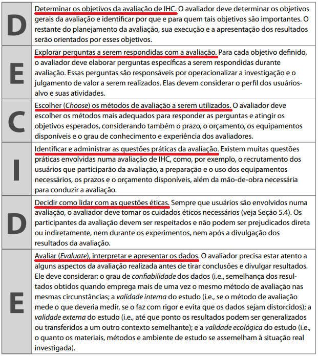

<h1 align="center">Aplicação do Framework DECIDE</h1>
 
## Introdução
Com o objetivo de tornar a avaliação sob o contexto da matéria de IHC mais eficiente e eficaz, a Framework DECIDE foi proposta por Preece et al(2002) para orientar seu planejamento, execução e análise (Barbosa, Silva, 2010). Esse modelo é muito compreensivo dos apectos de uma avaliação, com todos seus pontos iterativos sendo completamente interligados. Apesar de possíveis complicações que indiquem uma mudança de objetivos, é de suma importância a aplicação neste projeto de análise do serviço de agendamento da PCDF, visando a realização de uma avaliação compreensiva e bem desenvolvida.

## Aspectos da Framework DECIDE:
A framework DECIDE é nomeada desse modo por causa dos 6 (seis) aspectos principais que a compõem, como podem ser vistos na figura 1, a seguir:

<figcaption align='center'>
   <h6><b>Figura 1: Significado da Framework DECIDE. Fonte: Processos de Design de IHC. Pág. 313.</b></h6>
</figcaption>

A maioria do grupo já havia trabalhado com essa Framework no [planejamento da avaliação](docs/../2022.2-Grupo6/docs/escolha_do_site.md), habituando com a maneira de trabalhar dentro desse contexto.

## Aplicação da Framework DECIDE no contexto deste projeto:
Dentro do projeto de análise do serviço de agendamento do site da PCDF, a Framework DECIDE foi empregada ao longo das tarefas envolvendo a quarta entrega, vistos na seção Design, Avaliação e Desenvolvimento, artefatos que seguem a implementação deste. 

## Referências

> [1] BARBOSA; SILVA. **Processos de Design de IHC**. Rio de Janeiro: Elsevier, 2010. Cap. 9: Planejamento da Avaliação de IHC. Pág. 261-280. Acesso em: 14 de dezembro de 2022.

## Histórico de Versão

|  Data  | Versão | Descrição | Autor | Revisor |
| :----: | :----: | :-------: | :---: | :--------:|
| 14/12/2022 | 1.0 | Implementação do arquivo| Rodrigo de Andrade  | Gabriel Marcolino |

