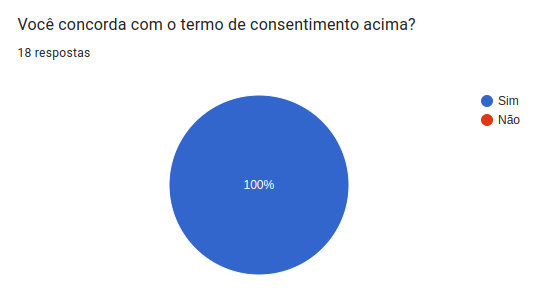
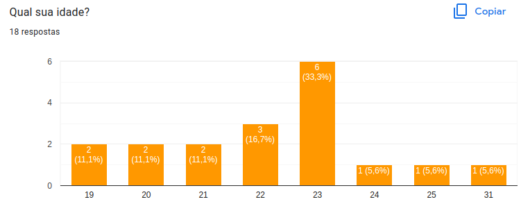
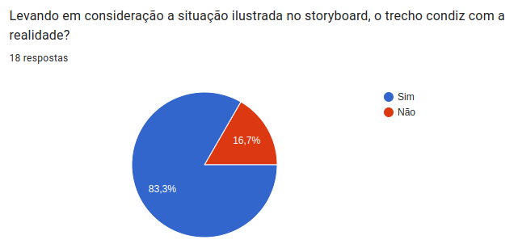
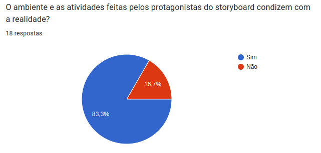
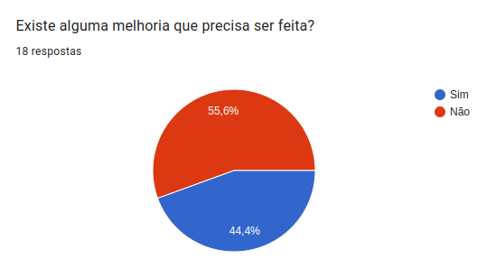
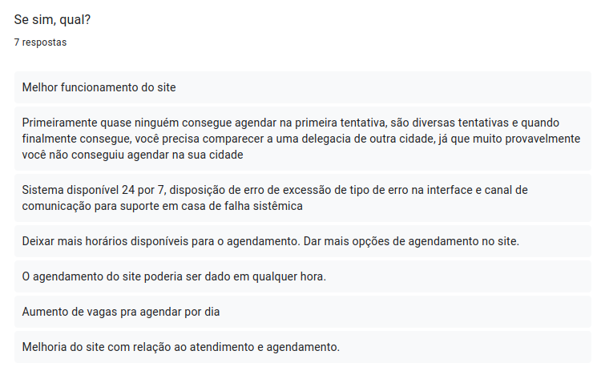
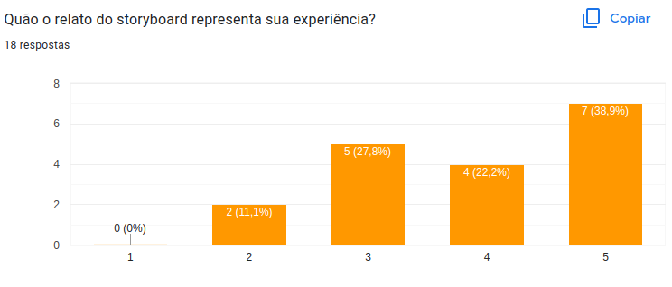

<h1 align="center">Avaliação do Storyboard</h1>

## Introdução
O storyboard é um tipo de protótipo de baixa fidelidade. É praticamente uma história demonstrando como o usuário consegue concluir uma tarefa utilizando o produto que está sendo avaliado ou criado. O storyboard em questão, retrata o usuário fazendo o agendamento da carteira de identidade, onde, num primeiro momento ele não consegue realizar a tarefa, mas ao se atentar aos horários do funcionamento do agendamento ele consegue concluir a tarefa com sucesso.

## Resultados

Como podemos analisar na figura 1, todos as pessoas que participaram da avaliação do storyboard concordaram com o termo de consentimento.

    
    <figcaption align='center'>
        <h6><b>Figura 1:</b> Respostas ao termo de consentimento. Fonte: Elaboração própria</h6>
    </figcaption>

 

Como podemos analaisar na figura 2, tivemos uma certa variedade de idades das pessoas que participaram da avaliação do storyboard, ficando entre 19 e 31 anos.

    
    <figcaption align='center'>
        <h6><b>Figura 2:</b> . Respostas das idades dos participantes. Fonte: Elaboração própria</h6>
    </figcaption>

 

Como podemos analisar na figura 3, o ambiente onde se passa a história relatada e as atividades realizadas no storyboard condizem com a realidade tendo apenas 3 participantes, 16,7%, que discordaram.

    
    <figcaption align='center'>
        <h6><b>Figura 3:</b> Respostas referentes se o storyboard condiz com a realidade. Fonte: Elaboração própria</h6>
    </figcaption>

 

Como podemos analisar na figura 4, o contexto do storyboard condiz com a realidade tendo apenas 3 participantes, 16,7%, que discordaram.

    
    <figcaption align='center'>
        <h6><b>Figura 4:</b> Respostas da pergunta. Fonte: Elaboração própria</h6>
    </figcaption>

 

Como podemos analisar na figura 5, 10 participantes responderam que o storyboard não necessita de melhoria e outros 8 responderam que precisa de melhoria, mas baseado nas respostas da figura 6, acredita-se que a pergunta feita no storyboard a respeito das melhorias não ficou expecificada e os participantes podem ter imaginado que a melhoria se referia ao site da PCDF e não do próprio storyboard.

    
    <figcaption align='center'>
        <h6><b>Figura 5:</b> Respostas se o storyboard precisa de melhorias. Fonte: Elaboração própria</h6>
    </figcaption>

 

    
    <figcaption align='center'>
        <h6><b>Figura 6:</b> Respostas das melhorias do site. Fonte: Elaboração própria</h6>
    </figcaption>

 

Como podemos analisar na figura 7, o quanto o storyboard representa a experiência do usuário ao utilizar o site da PDCF.

    
    <figcaption align='center'>
        <h6><b>Figura 7:</b> Respostas referentes a quanto o storyboard representa a experiência dos usuários. Fonte: Elaboração própria</h6>
    </figcaption>

 

## Refêrencia

> [1] 2020.1-BCE. GitHub. Disponível em: https://github.com/Interacao-Humano-Computador/2020.1-BCE. Acesso em: 21 de dezembro de 2022.

## Histórico de Versão

|    Data    | Versão |      Descrição       |                                              Autor(es)                                               |                 Revisor(es)                  |
| :--------: | :----: | :------------------: | :--------------------------------------------------------------------------------------------------: | :------------------------------------------: |
| 21/12/2022 |  1.0   | Criação do documento | [Gabriel Marcolino](https://github.com/GabrielMR360) e [Jefferson Franca](https://github.com/Frans6) | [Rodrigo](https://github.com/OrlandiRodrigo) |
