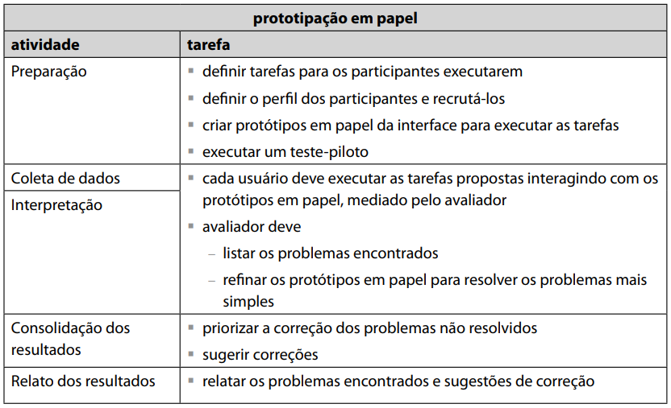
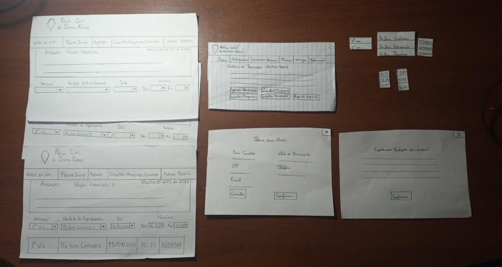

<h1 align="center">Relato dos Resultados da Avaliação do Protótipo de Baixa Fidelidade</h1>

## Introdução
O protótipo de baixa fidelidade empregado no projeto, como demonstrado anteriormente, foi o protótipo de papel. Para poder verificar a sua efetividade, ele foi analisado por meio do método de avaliação de <b>prototipação em papel</b>, cujo principal objetivo é avaliar a usabilidade de um design de IHC representado em papel, através de simulações de uso com a participação de potenciais usuários (Simone, Santana, 2021). Após escolhido o método de avaliação de IHC, e aplicado com base na framework DECIDE, foram feitos o teste piloto e a avaliação em si do protótipo de papel. 

## Utilizando o Percurso Cognitivo
De acordo com o planejamento pela framework DECIDE e com a ajuda do professor André Barros, foi determinado que a prototipação em papel seria o modo ideal de avaliar o protótipo de baixa fidelidade, por ser um modo rápido e barato de identificar problemas de usabilidade (Simone, Barbosa, 2021), apropriado para a fase conceitual de desenvolvimento do projeto, de acordo com o processo de design Ciclo de Vida para Engenharia de Usabilidade de Mayhew. A equipe encontrou como de ideal implementação na fase conceitual, parte do Processo de Design de Mayhew da qual a abordagem do protótipo de papel pode ser melhor incluída. 

### Motivo de Escolha e Aplicação
De acordo com a framework DECIDE, a prototipação em papel foi escolhida e aplicada pelos seguintes motivos:

* É extremamaente condizente com o <b>objetivo</b> da avaliação, sendo esse avaliar o protótipo de baixa fidelidade de forma conclusiva para obter dados necessários para o prosseguimento do projeto; 

* Seu desenvolvimento, como método de avaliação, envolve a <b>exploração</b> da tarefa a ser realizada pelo usuário, como pode ser visto na figura 1 a seguir. O usuário seguirá a realização da tarefa definida, fornecendo os dados necessários pela avaliação;  

    
    <figcaption align='center'>
        <h6><b>Figura 1:</b> Etapas detalhadas do método de avaliação de prototipação em papel. Fonte: Interação Humano-Computador; Página 359</h6>
    </figcaption>
 

* As <b>questões práticas</b>, envolvendo o perfil de usuário, o ambiente do teste e a organização da mão-de-obra disponível, assim como as <b>questões éticas</b>, dentre as quais permitirão a avaliação apenas com a leitura e assinatura do termo de consentimento entregue ao usuário, serão facilmente definidas e aplicáveis na prototipação em papel;

* Por fim, o objetivo da prototipação em papel é fornecer dados que serão <b>avaliados e interpretados</b> pela equipe. É necessário levar em consideração o grau de confiabilidade dos dados obtidos, assim como a validade interna, externa e ecológica do estudo, considerações que serão apresentadas junto aos resultados. 

### Preparação

A fase de preparação do projeto incluiu a definição de tarefas a serem realizadas, o recrutamento de usuários, a criação de protótipos em papel e a execução de um teste piloto.

Primeiramente, foi elaborada uma tabela de planejamento para a realização das atividades, sendo essa a tabela 1, a seguir:

|      Dia e Horário        |                 Atividades Realizadas                   |              Autor(es)               | 
| :-----------------------: | :-----------------------------------------------------: | :----------------------------------: | 
|    05/01/2023, às 19h     |       Reunião com o Grupo para Divisão de Tarefas       | Rodrigo, Guilherme, Yago, Gabriel, Jefferson, Lucas | 
|    09/01/2023, às 19h15m  | Organização do Protótipo de Papel e Dias para Avaliação | Rodrigo, Guilherme, Yago             | 
|    10/01/2023, às 14h     |               Realização do Teste Piloto                | Guilherme, Yago                      | 
|    10/01/2023, às 16h     |       Realização da Avaliação do Protótipo de Papel     | Guilherme, Rodrigo                   |

<figcaption align='center'>
   <h6><b>Tabela 1:</b> Cronograma de atividades relacionadas à avaliação do protótipo de papel. Fonte : Elaboração de Rodrigo </h6>
</figcaption>

#### Definição de Tarefas
Na organização do dia 09/01, foi decidido os conteúdos do protótipo de papel e a tarefa a ser realizada. A tarefa desta avaliação foi apenas a realização do agendamento no site da Polícia Civil do Distrito Federal, realizada por meio do protótipo de papel. A estrutura do protótipo seguiu de forma rigorosa a estrutura estabelecida no planejamento do protótipo de papel.

#### Recrutamento de Usuários
Dentro do mesmo dia, 5 (cinco) potenciais usuários foram contatados por WhatsApp para a realização da avaliação no dia 10/01. Os usuários previamente demonstraram conhecimento sobre tentativas de agendamento para serviços da identidade, mas apenas 1 usuário confirmou e apareceu para a realização da avaliação.

#### Criação do Protótipo de Papel para a Execução das Atividades
O protótipo de papel criado para a avaliação por prototipação de papel está ilustrado abaixo, pela figura 2. Ele foi elaborado com o objetivo de representar facilmente as opções do agendamento;

* Ao invés do sistema rígido no site que define as horas na qual abrem vagas, esse sistema apresenta todos os horários disponíveis no local no qual o usuário deseje visitar, sendo executado com base em planejamento de horários já presentes no sistema, que difere do site da PCDF, o qual abre diversas vagas em vários locais diferentes, que podem ou não ser visitáveis pelo usuário.

* O protótipo foi desenvolvido para ser facilmente entendível por qualquer usuário, e intuitivo o suficiente para a realização simples da tarefa. A equipe se baseou nas metas de usabilidade, especialmente as de eficácia, eficiência, fácil aprendizagem, e de segurança para o desenvolvimento do protótipo.

    <figcaption align='center'>
        <h6><b>Figura 2:</b> Protótipo de papel utilizado na avaliação. Fonte: Elaboração de Guilherme e Yago</h6>
    </figcaption>
 

#### Execução e Resultados do Teste Piloto

O vídeo a seguir apresenta a execução do teste piloto do projeto no dia 10/01.

<iframe width="1000vw" height="400vh" src="https://youtu.be/iFMzRF4-SsQ" title="YouTube video player" frameborder="0" allow="accelerometer; autoplay; clipboard-write; encrypted-media; gyroscope; picture-in-picture" allowfullscreen></iframe>
 

Como observado, o teste correu bem duranto todo seu prolongamento. Não há correções a serem feitas, e julgamos que o teste não necessita de melhorias imediatas, visto que ele tem natureza de baixa fidelidade. O que deve ser levado em consideração é que os participantes do teste já sabiam como o processo deveria ocorrer e quais seus passos, logo, o resultado do teste com usuário tende a diferenciar-se.  

## Coleta de Dados e Interpretação de Dados
O objetivo dessa atividade de avaliação por interrogação é de registrar as experiências vivenciadas pelos usuários participantes. A cordialidade do avaliador Rodrigo foi essencial para deixar a usuária à vontade para relatar o processo de prototipação aplicado pela equipe.
Após as etapas iniciais de recepção do participante, apresentação e assinatura do termo de consentimento, é iniciado a sessão de observação. Os dois avaliadores responsáveis da dinâmica atentaram-se aos passos tomados pela usuária e o processo inteiro foi gravado para a interpretação futura dos dados.  

<iframe width="1000vw" height="400vh" src="https://youtu.be/iFMzRF4-SsQ" title="YouTube video player" frameborder="0" allow="accelerometer; autoplay; clipboard-write; encrypted-media; gyroscope; picture-in-picture" allowfullscreen></iframe>
 
Com o vídeo em mãos, bastou editá-lo para que ficasse apresnetável. Então, os avaliadores o reassistiram prestando atenção em detalhes como possíveis hesitações por parte da usuária na hora de prosseguir as etapas da tarefa. Tendo em vista todos esses pequenos aspectos, tão como o relato da participante convidada, julgou-se um protótipo intuitivo, eficiente e realista, que consegue guiar a usuária pela tarefa sem causar estranhamentos ou confusões. Melhorias e correções serão, pois, suspensas por enquanto.

## Resultados da Avaliação
A avaliação no que tange o protótipo de papel verificou-se um sucesso. Os processo do método investigativo ocorreu de acordo com o que foi previamente planejado pela equipe e os resultados foram satisfatórios. A usuária entrevistada julgou o protótipo de papel como "completo" e "exatamento como necessário", portanto não tendo dificuldades para executar o que lhe foi atribuída. 

## Refêrencias

> [1] BARBOSA, Simone et al. Métodos de- Avaliação de IHC. _In_: BARBOSA, Simone. **Interação Humano-Computador**. Elsevier, 2021. p. 358-362

## Histórico de Versão

|    Data    | Versão |      Descrição       |                                              Autor(es)                                               |                 Revisor(es)                  |
| :--------: | :----: | :------------------: | :--------------------------------------------------------------------------------------------------: | :------------------------------------------: |
| 21/12/2022 |  1.0   | Criação do artefato. | [Rodrigo](https://github.com/OrlandiRodrigo), [Yago](https://github.com/yagompassos) e [Guilherme](https://github.com/GG555-13) | [Gabriel](https://github.com/GabrielMR360) e [Rodrigo](https://github.com/OrlandiRodrigo) |
| 21/12/2022 |  1.1  | Execução e resultados do teste piloto. | [Yago](https://github.com/yagompassos) | [Gabriel](https://github.com/GabrielMR360) e [Rodrigo](https://github.com/OrlandiRodrigo) |
| 21/12/2022 |  1.2  | Coleta de dados e Interpretação de dados | [Yago](https://github.com/yagompassos) | [Gabriel](https://github.com/GabrielMR360) e [Rodrigo](https://github.com/OrlandiRodrigo) |
| 21/12/2022 |  1.3   | Resultados da avaliação | [Rodrigo](https://github.com/OrlandiRodrigo), [Yago](https://github.com/yagompassos) e [Guilherme](https://github.com/GG555-13) | [Gabriel](https://github.com/GabrielMR360) e [Rodrigo](https://github.com/OrlandiRodrigo) |
