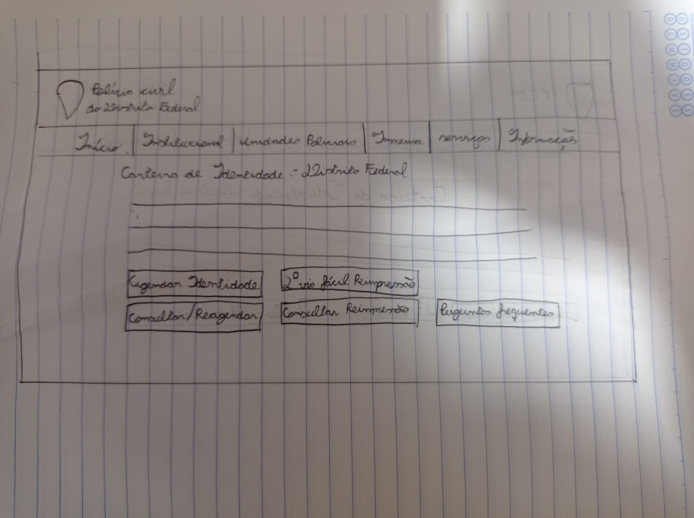
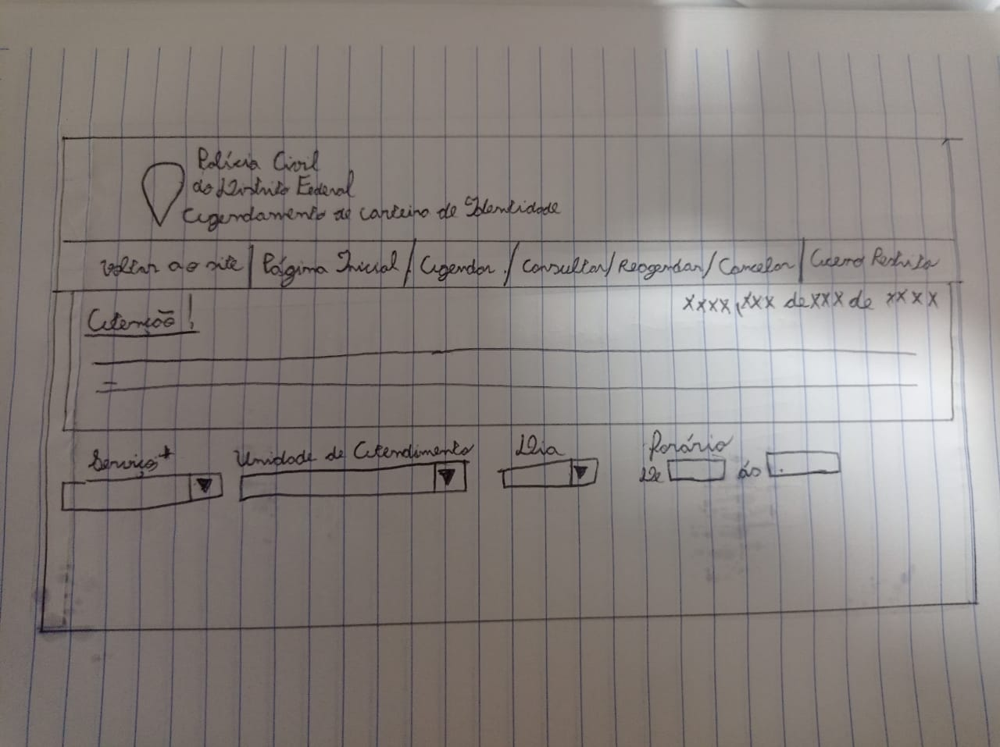
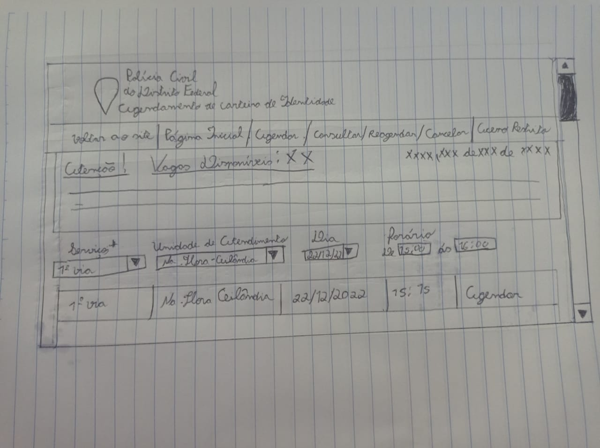

<h1 align="center">Planejamento da Avaliação do Protótipo de Papel</h1>

## 1. Introdução

Durante o desenvolvimento de um design, é comum a utilização de protótipos para se testar e validar ideias. Protótipos são representações limitadas de um design que permitem interação e exploração por parte dos usuários, podendo eles serem de baixa fidelidade (simples e baratos) ou de alta fidelidade (mais robustos, porém complexos de produzir).

Se tratando de IHC, pode-se usar protótipos de papel para simular o uso de um sistema através de desenhos dos elementos do design proposto.

Este documento visa registrar o planejamento realizado pela equipe para a realização de uma avaliação usando um protótipo de papel.

## 2. Metodologia

Será simulado o agendamento de carteira de identidade através do site da PCDF com as correções propostas pela equipe para os problemas encontrados. Durante essa atividade, será observado o comportamento do usuário a fim de se confirmar se o novo design satisfaz as necessidades do mesmo e é realmente uma alternativa superior àquela atualmente implementada.

## 3. Avaliação

### 3.1 Tarefas para os participantes

Dado o escopo limitado, os participantes da avaliação farão duas tarefas simples: 

* **escolher uma opção de agendamento** 

* **agendamento do documento**

**3.1.1 Escolha da opção de agendamento**

Nessa atividade, o usuário escolherá dentre as opções de agendar a primeira via, segunda via ou a segunda via fácil da carteira de identidade, conforme mostra o esboço mostrado na Figura 1.

<figcaption align='center'>
   <h6><b>Figura 1: Opções de agendamento da identidade Fonte: Autoria própria </h6></b>
</figcaption>

**3.1.2 Agendamento do documento**

Nessa etapa, o usuário realizará o agendamento propriamente dito, escolhendo a unidade de atendimento, dia e horário que julgar mais adequado.

O objetivo é descobrir se o usuário é capaz de completar o processo sem dificuldades, de forma intuitiva.

A avaliação seguirá da seguinte forma:

Será mostrada a tela contendo as opções, conforme esboçado pela Figura 2.

<figcaption align='center'>
   <h6><b>Figura 2: Tela de agendamento da identidade Fonte: Autoria própria </h6></b>
</figcaption>

O usuário será contextualizado, sendo informado que deverá escolher o local, dia e infomar o horário que lhe seria apropriado para ir retirar o documento.

Após isso, será pedido ao participante que realize a tarefa através dos desenhos dos elementos da interface.

Deverá ser observada as ações do participante, ajudando-o se necessário e provendo os esboços de opções quando apropriado.

Após todos os campos serem preenchidos, será mostrado ao participante quantas vagas há disponíveis para aquele horário e unidade, além da opção de agendamento, conforme ilustra o esboço da Figura 3.

<figcaption align='center'>
   <h6><b>Figura 2: Finalização do agendamento da identidade Fonte: Autoria própria </h6></b>
</figcaption>

### 3.2 Perfil dos participantes

Para a realização dessa avaliação, serão convidadas pessoas que atendem ao perfil de usuário levantado pela equipe, conforme consta no documento [Perfil de Usuário](../analise-de-requisitos/perfil_usuario.md). 

### 3.3 Execução do Teste Piloto

Teste piloto trata-se de um teste realizado antes da avaliação para verificar se há alguma falha que possa impedir o realizamento do teste.

Assim, caso seja detectado algum problema, ele deverá ser anotado e corrigido em uma futura modificação.

### 3.4 Execução da Avaliação

Em uma data estipulada, será realizada uma reunião entre o participante e o avaliador para a execução da avaliação. Devido ao caráter do protótipo, esta deverá ser presencial.

Nela, deverá ser explicado todo o processo que será realizado na avaliação.

Vale frisar deverá ser mostrado o Termo de Consetimento ao participante, informado-o que sua participação não é obrigatória. Caso haja discordância do usuário com relação ao termo, a avaliação deverá ser cancelada imediatamente, sem causar desconforto ao usuário e sem represálias.

Caso o participante concorde em prosseguir, a avaliação deverá correr normalmente, sendo fornecido todo o material necessário.

## Histórico de Versão
|    Data    | Versão |                          Descrição                          |                                            Autor(es)                                             |                                               Revisor                                                |
| :--------: | :----: | :---------------------------------------------------------: | :----------------------------------------------------------------------------------------------: | :--------------------------------------------------------------------------------------------------: |
| 21/12/2022 |  1.0   |                    Criação do documento                     | [Lucas Spinosa](https://github.com/LucasSpinosa) | [Gabriel Marcolino](https://github.com/GabrielMR360) e [Yago Passos](https://github.com/yagompassos) |