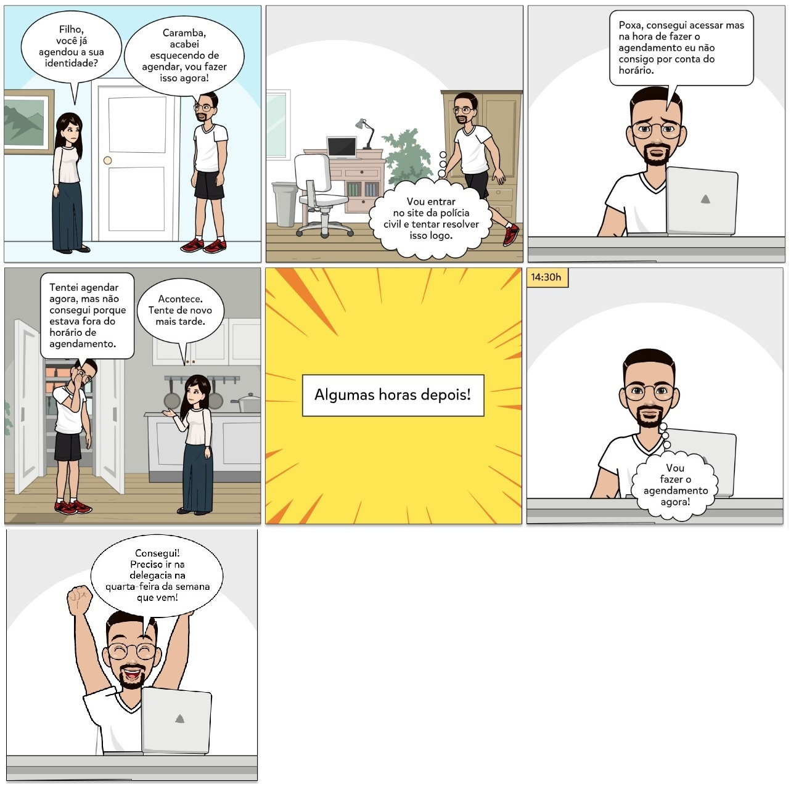

<h1 align="center">Planejamento da Avaliação do Storyboard</h1>

## Introdução

"A avaliação de IHC é uma atividade fundamental em qualquer processo de desenvolvimento que busque produzir um sistema interativo com alta qualidade de uso. Ela orienta o avaliador a fazer um julgamento de valor sobre a qualidade de uso da solução de IHC e a identificar problemas na interação e na interface que prejudiquem a experiência particular do usuário durante o uso do sistema. Assim, é possível corrigir os problemas relacionados com a qualidade de uso antes de inserir o sistema interativo no cotidiano dos usuários, seja um sistema novo ou uma nova versão de algum sistema existente" [(BARBOSA, 2021, p. 261)](#referencias).

## Metodologia

Para realizar o planejamento da avaliação foi adotado o framework DECIDE como base. Ele tem como objetivo princicpal guiar o planejamento passando por 6 etapas, que são: 

**D - Determinar** os objetivos da avaliação de IHC. O avaliador deve determinar os objetivos gerais da
avaliação e identificar por que e para quem tais objetivos são importantes.

**E - Explorar** perguntas a serem respondidas com a avaliação. 

**C - Escolher(Choose)** os métodos de avaliação a serem utilizados. O avaliador deve escolher os métodos
mais adequados para responder as perguntas e atingir os objetivos esperados, considerando também
o prazo, o orçamento, os equipamentos disponíveis e o grau de conhecimento e experiência dos
avaliadores.

**I - Identificar** e administrar as questões práticas da avaliação. 

**D - Decidir** como lidar com as questões éticas. Sempre que usuários são envolvidos numa avaliação, o
avaliador deve tomar os cuidados éticos necessários. Os participantes da avaliação
devem ser respeitados e não podem ser prejudicados direta ou indiretamente, nem durante os
experimentos, nem após a divulgação dos resultados da avaliação.

**E - Avaliar(Evaluate)**, interpretar e apresentar os dados. O avaliador precisa estar atento a alguns
aspectos da avaliação realizada antes de tirar conclusões e divulgar resultados. 

## Objetivo da avaliação

O objetivo da avaliação é visualizar e avaliar o problema levantado pelo storyboard, tendo em mente os principais objetivos de:

- Averiguar se o storyboard condiz com a realidade;
- Averiguar se o storyboard necessita de alguma melhoria;

## Perguntas a serem respondidas

Na tabela 1 podemos ver as perguntas elaboradas para que o(s) participante(s) respondam durante a fase da avaliação.

| Questão |                                           Pergunta                                            |     Opções de resposta     |
| :-----: | :-------------------------------------------------------------------------------------------: | :------------------------: |
|    1    |                                 Qual o seu nome e sua idade?                                  |    Pergunta discursiva     |
|    2    | O ambiente e as atividades feitas pelos protagonistas do storyboard condizem com a realidade? |      Sim [ ] Não [ ]       |
|    3    | Levando em consideração a situação ilustrada no storyboard, o trecho condiz com a realidade?  |      Sim [ ] Não [ ]       |
|    4    |                  Existe alguma melhoria que precisa ser feita? Se sim, qual?                  |    Pergunta discursiva     |
|    5    |                    Quão o relato do storyboard representa sua experiência?                    | Pouco[] Razoável[] Muito[] |

<figcaption align='center'>
   <h6><b>Tabela 1:</b> Peguntas a serem respondidas pelo(s) participante(s). Fonte : Elaboração de Jefferson</h6>
</figcaption>
 

## Método de avaliação

O método de avaliação escolhido foi o de questionário. Este método é flexível, permitindo perguntas pouco abertas ou fechadas, além da opção de requerir resposta discursiva, e potencialmente pode ser apresentado e respondido por uma base de usuários mais ampla, proporcionando aos pesquisadores uma visão generalizada do público alvo ao qual foi disponibilizado o questionário.

O questionário será feito por meio do Google Forms, e visa apresentar um dos maiores defeitos do site da PCDF, que é o período de agendamento altamente estrito, em um caso aplicável à população da pesquisa, a qual são estudantes universitários de 18 (dezoito) a 25 (vinte e cinco) anos, de acordo com o Perfil de Usuário traçado.

## Questões éticas

As [questões éticas]() serão de alta relevância à entrevista. Será disponibilizado um termo de consentimento para o participante, para que ele esteja ciente do que está acontecendo. O participante é livre para deixar a entrevista a qualquer momento caso se sinta desconfortável com as perguntas sendo feitas ou algum outro fator de desconforto. 

Caso o participante aceite o termo de consentimento ele pode começar a responder o entrevista.

## Questões práticas da avaliação

As [questões práticas]() incluem a alocação do pessoal, recursos e equipamentos e preparação do material de apoio, assim como a preparação do ambiente de teste, a realização do teste piloto e o recrutamento dos participantes para a entrevista.

### Teste piloto

O teste piloto será realizado antes da entrevista. Seu objetivo é realizar uma versão primitiva da futura entrevista com os usuários, analisando se a avaliação produz os dados necessários para responder a as questões e objetivos de estudo. O teste piloto será feito com outro participante do grupo, e a data para sua realização pode ser vista no cronograma a seguir, representado pela tabela 2.

### Cronograma

Como ilustrado na tabela 2 abaixo, observam-se as datas e os responsáveis por realizar o teste piloto, a entrevista e a documentação dos resultados.

|    Data    | Hora  |          Atividade          |      Autor(es)      |          Local          |     Revisor(es)     |
| :--------: | :---: | :-------------------------: | :-----------------: | :---------------------: | :-----------------: |
| 20/12/2022 | 10:20 |        Teste Piloto         | Rodrigo e Jefferson | FGA (Faculdade do Gama) | Gabriel e Jefferson |
| 20/12/2022 | 16:20 |        Questionário         | Gabriel e Jefferson | FGA (Faculdade do Gama) |       Rodrigo       |
| 21/12/2022 | 19:00 | Documentação dos resultados | Gabriel e Jefferson |    Casa dos autores     |       Rodrigo       |

<figcaption align='center'>
   <h6><b>Tabela 2:</b> Cronogranama. Fonte : Elaboração de Jefferson</h6>
</figcaption>
 

## Avaliação e relato dos dados

Após a realização do questionário e documentação dos dados obtidos, o levantamento dos resultados da entrevista será desenvolvido no dia 21/12/2022, conforme representado na tabela 2, por meio de um relato de resultados, o qual será apresentado na seção seguinte deste site, correspondente à Entrega 5.

## Storyboard

Como mostrado na figura 1, no storyboard, temos o processo de agendamento da carteira de identidade. Num primeiro momento a tentativa de agendamento não obteve sucesso, pois o personagem principal não se atentou aos horários que o site da PCDF disponibiliza para efetivar o agendamento, logo após, ele acessa o site no horário recomendado e consegue concluir a tarefa com sucesso.

<figcaption align='center'>
   <h6><b>Figura 1: Storyboard do agendamento da carteira. Fonte: Jefferson e Gabriel </h6>
</figcaption>

## Referências

> [[1]](#introducao) BARBOSA, Simone et al. Planejamento da Avaliação de IHC. _In_: BARBOSA, Simone. **Interação Humano-Computador e Experiência do Usuário**. Autopublicação, 2021. p. 261-280
>
> [2] Pixton. Acesso em: 17 de dezembro de 2022. Disponível em: https://www.pixton.com/

## Histórico de Versão

|    Data    | Versão |                 Descrição                 |                                              Autor(es)                                               |                  Revisor(es)                  |
| :--------: | :----: | :---------------------------------------: | :--------------------------------------------------------------------------------------------------: | :-------------------------------------------: |
| 13/12/2022 |  1.0   |           Criação do documento            | [Gabriel Marcolino](https://github.com/GabrielMR360) e [Jefferson Franca](https://github.com/Frans6) | [Yago Passos](https://github.com/yagompassos) |
| 14/12/2022 |  1.1   | Adicionando as questões práticas e éticas | [Gabriel Marcolino](https://github.com/GabrielMR360) e [Jefferson Franca](https://github.com/Frans6) | [Yago Passos](https://github.com/yagompassos) |
| 20/12/2022 |  1.2   |          Adicionando storyboard           | [Gabriel Marcolino](https://github.com/GabrielMR360) e [Jefferson Franca](https://github.com/Frans6) | [Yago Passos](https://github.com/yagompassos) |
| 21/12/2022 |  1.3   |          Corrigindo implementação de entrevista para questionário (av. do Storyboard)          | [Rodrigo Orlandi](https://github.com/OrlandiRodrigo) | [Jefferson Franca](https://github.com/Frans6) |
