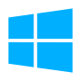

<h1 align="center">Ferramentas</h1>

## Introdução
Neste documento se encontra a lista de ferramentas que usaremos para o desenvolvimento do projeto, seja para criação ou auxílio. Novas ferramentas podem ser inseridas se houver necessidade, todas são gratuitas e de fácil acesso.

|                 Ferramenta                  |    Nome    |                                                                         Utilidade                                                                          |
| :-----------------------------------------: | :--------: | :--------------------------------------------------------------------------------------------------------------------------------------------------------: |
|      |   GitHub   |            GitHub é um serviço online para desenvolvimento de software e controle de versão. Usado para hospedagem do repositório do projeto e arquivos relacionados. |
|    |  Discord   |             Discord é uma plataforma para comunicação por chamadas de voz, vídeo e mensagens. Usada para reuniões de planejamentos de tarefas.             |
|    |  YouTube   |                 YouTube é uma plataforma de hospedagem e compartilhamento de vídeos. Usada para upload de vídeos relacionados ao projeto.                  |
|  |  WhatsApp  |            WhatsApp é uma plataforma gratuita de mensagens instantâneas. Usada como principal meio de comunicação entre intregrantes do grupo.             |
|  |  Telegram  |                 Telegram, assim como o WhatsApp, é um serviço de mensagens instantâneas. Usado para comunicação com professor e monitores.                 |
|    | Windows 10 |                        O Windows 10 possui uma ferramenta integrada de gravação de tela, chamada de Xbox Game Bar. Usado pela equipe para realizar gravações.                       |
|    | Figma |                              O Figma é uma aplicação web usada para se fazer design de interface. Usada para prototipações de interfaces. |
|    | Visual Studio Code |                        O Visual Studio Code se trata de um editor de texto criado pela Microsoft para desenvolvimento de código. Usado pela equipe para criar documentos. |
|    | MkDocs |                       O MkDocs é um gerador de site usado para documentações de projetos. Usado pela a equipe para documentação. |

## Bibliografia

> [1] GITHUB. 2022. Disponível em: <https://github.com/>. Acesso em 24 de novembro de 2022.

> [2] DISCORD. 2022. Disponível em: <https://discord.com/>. Acesso em 24 de novembro de 2022.

> [3] YOUTUBE. 2022. Disponível em: <https://youtube.com/>. Acesso em 24 de novembro de 2022.

> [4] WHATSAPP. 2022. Disponível em: <https://whatsapp.com/>. Acesso em 24 de novembro de 2022.

> [5] TELEGRAM. 2022. Disponível em: <https://www.telegram.org>. Acesso em 24 de novembro de 2022.

> [6] MICROSOFT 2022. Disponível em: <https://support.microsoft.com/en-us/windows/record-a-game-clip-on-your-pc-with-xbox-game-bar-2f477001-54d4-1276-9144-b0416a307f3c>. Acesso em 24 de novembro de 2022.

> [7] FIGMA. 2022. Disponível em: <https://figma.com/>. Acesso em 24 de novembro de 2022.

> [8] VISUAL STUDIO CODE. 2022. Disponível em: <https://code.visualstudio.com>. Acesso em 24 de novembro de 2022.

> [9] GITHUB. 2022. Disponível em: <https://www.mkdocs.org>. Acesso em 24 de novembro de 2022.

## Histórico de Versão

|    Data    | Versão |          Descrição               |                      Autor                       | Revisor |
| :--------: | :----: | :------------------------------: | :----------------------------------------------: | :-----: |
| 22/11/2022 |  1.0   |    Criação do documento          | [Lucas Spinosa](https://github.com/LucasSpinosa) | [Rodrigo de Andrade](https://github.com/OrlandiRodrigo) |
| 22/11/2022 |  1.1   | Adição do Figma, VSCode e MkDocs | [Lucas Spinosa](https://github.com/LucasSpinosa) | [Rodrigo de Andrade](https://github.com/OrlandiRodrigo) |
| 23/11/2022 |  1.2   | Adição de texto introdutóro      | [Jefferson França](https://github.com/Frans6)    | [Rodrigo de Andrade](https://github.com/OrlandiRodrigo) |
| 24/11/2022 |  1.3   | Adição da bibliografia | [Rodrigo de Andrade](https://github.com/OrlandiRodrigo) | [Rodrigo de Andrade](https://github.com/OrlandiRodrigo) |