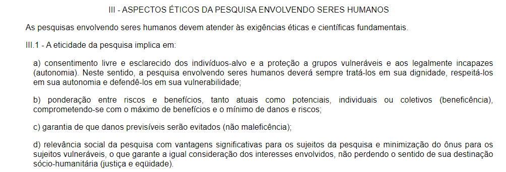

<h1 align="center">Análise de Tarefas</h1>
 
## Introdução
Durante a avaliação, considerando a presença de usuários, as questões éticas serão de alta relevância à entrevista, com o objetivo de seguir ao máximo os [Critérios da Ética em Pesquisa com Seres Humanos conforme Resolução no. 196/96 do Conselho Nacional de Saúde](https://bvsms.saude.gov.br/bvs/saudelegis/cns/1996/res0196_10_10_1996.html). É de suma importância que a parte entrevistada entenda e concorde com os princípios éticos abordados durante essa entrevista, após ler o Termo de Consentimento presente em Termos, na aba Análise de Tarefas.

## Quanto a Pesquisa:
A entrevista feita pelo Grupo 6 é obrigada a seguir os pontos de eticidade da pesquisa apresentados no tópico III (três) da Resolução no. 196/96 do Conselho Nacional de Saúde, sendo estes apresentados pela figura 1, a seguir:

<figcaption align='center'>
   <h6><b>Figura 1: Critérios para a eticidade de uma pesquisa. Fonte: Resolução no. 196/96 do Conselho Nacional de Saúde.</h6>
</figcaption>

Dentre as 26 exigências destacadas no tópico III.3, acerca de tópicos que a pesquisa envolvendo seres humanos tem de tratar corretamente, se destacam:
<ul>
  <li>d) prevalecer sempre as probabilidades dos benefícios esperados sobre os riscos previsíveis; </li>
  <li>g) contar com o consentimento livre e esclarecido do sujeito da pesquisa e/ou seu representante legal;
  <li>h) contar com os recursos humanos e materiais necessários que garantam o bem-estar do sujeito da pesquisa, devendo ainda haver adequação entre a competência do pesquisador e o projeto proposto;
  <li>l) respeitar sempre os valores culturais, sociais, morais, religiosos e éticos, bem como os hábitos e costumes quando as pesquisas envolverem comunidades;
  <li>p) assegurar aos sujeitos da pesquisa os benefícios resultantes do projeto, seja em termos de retorno social, acesso aos procedimentos, produtos ou agentes da pesquisa.</li>
</ul>

## Quanto aos Participantes:
Antes da entrevista, os participantes podem/devem:
<ul>
  <li>não concordar com o termo de consentimento apresentado; </li>
  <li>ficar ciente sobre a gravação e anotação de dados que ocorrerá durante a entrevista;
  <li>ficar ciente sobre o anonimato na apresentação dos dados adquiridos;
  <li>ser propriamente apresentado/a ao ambiente, se acostumar e criar conforto;
  <li>conversar casualmente entre si ou com os entrevistadores, criando um ambiente mais amigável.</li>
</ul>

Durante a entrevista, os participantes podem/devem:
<ul>
  <li><b>desistir a qualquer momento da entrevista, seja qual for o motivo </b)>; </li>
  <li>responder às perguntas de forma coesa;
  <li>levar o tempo necessário para se expressar.</li>
</ul>

## Referências

> [1] Critérios de Ética, Resolução no. 196/96 do Conselho Nacional de Saúde. Disponível em: https://bvsms.saude.gov.br/bvs/saudelegis/cns/1996/res0196_10_10_1996.html. Acesso em 14 de dezembro de 2022.

> [2] BARBOSA; SILVA. **Processos de Design de IHC**. Cap. 6. Acesso em: 6 de dezembro de 2022.

## Histórico de Versão

|  Data  | Versão | Descrição | Autor | Revisor |
| :----: | :----: | :-------: | :---: | :--------:|
| 14/12/2022 | 1.0 | Implementação do arquivo| Rodrigo de Andrade  | Yago Passos |

