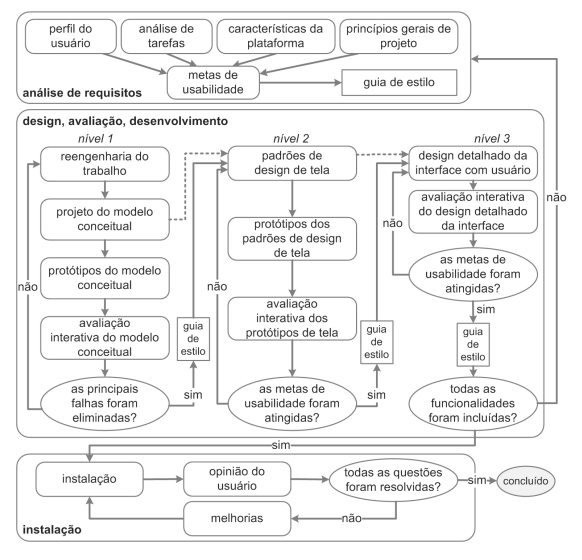

<h1 align="center">Processo de Design</h1>
 
## Introdução
Visando a escolha do processo de design mais apropriado para a realização da avaliação do site, o grupo ficou entre a escolha de algumas opções apresentadas em *"Processos de Design de IHC"* (Barbosa e Silva, 2010), junto com a aula apresentada sobre este conteúdo pelo professor André Barros de Sales.

Escolher um processo de design adequado à experiência do grupo e que mais acomode o trabalho é uma tarefa de grande importância, visto que será a principal estrutura básica que o grupo deverá utilizar para o desenvolvimento do projeto adequado, sob a perspectiva da matéria de IHC.

## Processos de Design Escolhido Pelo Grupo

    <figcaption align='center'>
        <h5><b>Figura 1:</b> Ciclo de vida para engenharia de usabilidade	de Mayhew
    </figcaption>
    
    <figcaption align='center'>
        <h6>Fonte: Barbosa, 2021, pág. 110
    </figcaption>

A figura 1 mostra o ciclo de vida para Engenharia de Usabilidade de Mayhew, é um processo de design compreensivo e detalhado, dque tem três fases do desenvolvimento do projeto, sendo essas a análise de requisitos, a fase de design e a instalação. O motivo da escolha deste processo em particular veio através de aulas onde foi altamente recomendado, considerando a esxperiência do grupo com o desenvolvimento de projetos desse estilo. Um ciclo mais direto ao ponto, como O Ciclo de Vida Simples, acaba por tirar muitos detalhes e considera que o avaliador já está acostumado com todas as atividades, necessitando apenas de uma referência em vez de um guia.

## Referências

> [1] BARBOSA; SILVA. **Processos de Design de IHC**. Cap. 4. Acesso em: 21 de novembro de 2022.

> [2] SALES, André Barros. Aula 4. Disponível em: <https://aprender3.unb.br/>. Acesso em: 21 de novembro de 2022.

## Histórico de Versão

|  Data  | Versão | Descrição | Autor | Revisor |
| :----: | :----: | :-------: | :---: | :--------:|
| 21/11/2022 | 1.0 | Abordagem do processo de design do projeto | [Yago Passos](https://github.com/yagompassos) [Rodrigo de Andrade](https://github.com/OrlandiRodrigo)  | [Rodrigo de Andrade](https://github.com/OrlandiRodrigo) |
| 04/12/2022 | 1.1 | Atualizando figura do ciclo de vida e adicionando legenda | [Gabriel Marcolino](https://github.com/GabrielMR360) | |